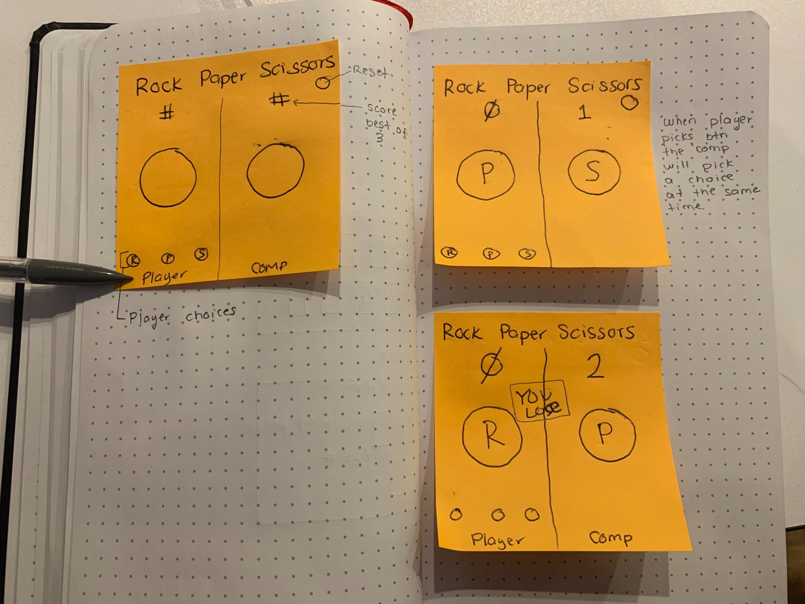

# Project-0-RPS
<h1>Rock, Paper, Scissors</h1>

<h2>What is this game?</h2>
It is the traditional game of rock, paper, scissors. 

<h2>Why I made it</h2>
I wanted to apply the skills I have learned in the last 3 weeks to solidify that knowledge. 

In this game I first began with a UI that would display the player as well as the computer. Once designed I moved away from that wireframe due to how crowded and unstructured. I decided on a center, cleaner, easy to understand and recognize design. 

In the CSS, I added a keyframe that would make a choice shake when hovered to easily highlight what choice was being made.

In the js doc I have a long conditional function with all the different winning, losing, and drawing (?) posibilites in rock, paper, scissors. I also added a reset button to restart the game. 

When approaching this game I first broke the game down into the functions I know I would have to do. Such as, winning combinations, giving a point to the winner, making sure the computer gave a random choice, and a reset button. 

One of the only unsolved problems is that the game will go on forever instead of deciding a winner after a 'best of 3'. 

<h2>How to play:</h2>
-Rock beats scissors 
-Scissors beat paper 
-Paper beats rock (still dont know why) 
-Take your pick and beat the computer. 
-Best out of 3! 

<h3>Play Here:</h3>
<href="https://pages.git.generalassemb.ly/angelz510/Project-0-Rock-Paper-Scissors/>

<h2>Wireframe</h2>

<h4>Bugs</h4>
-Wont end after 3 rounds.
